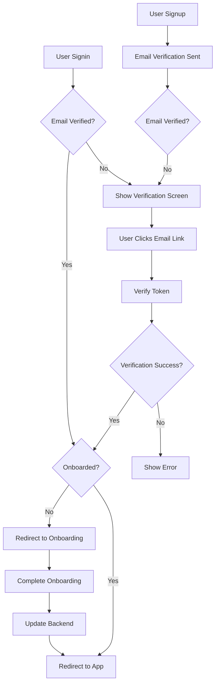

# Authentication Flow - Complete Implementation

## 🎉 Enhanced Authentication System

The authentication system now includes **email verification** and **onboarding flow** integration as requested:

### ✅ **Updated Flow After Signup**

1. **User Registration** → **Email Verification** → **Onboarding** → **Dashboard**

```typescript
// 1. User signs up
await authAPI.register({ email, password, confirmPassword });

// 2. Email verification sent automatically
await emailVerificationAPI.sendVerification();

// 3. User clicks email link → /verify-email?token=xxx
// 4. Email verified → Redirect to /onboarding (if not onboarded)
// 5. Onboarding completed → Redirect to /app
```

### ✅ **Updated Flow After Signin**

1. **User Login** → **Check Email Verification** → **Check Onboarding** → **Redirect Appropriately**

```typescript
// 1. User signs in
const { user } = await authAPI.login({ email, password });

// 2. Check email verification status
if (!user.emailVerified) {
  // Show email verification screen
  setAuthMode("email-verification");
  return;
}

// 3. Check onboarding status
if (!user.isOnboarded) {
  navigate("/onboarding");
} else {
  navigate("/app");
}
```

## 🔧 **New Components Added**

### **1. Enhanced Authentication.tsx**

- ✅ Email verification UI after signup
- ✅ Email verification check on signin
- ✅ Resend verification email functionality
- ✅ Onboarding redirection logic

### **2. EmailVerificationCallback.tsx**

- ✅ Handles email verification links (`/verify-email?token=xxx`)
- ✅ Confirms verification with backend
- ✅ Redirects to onboarding or dashboard based on user status

### **3. OnboardingWrapper.tsx**

- ✅ Integrates with backend onboarding API
- ✅ Handles onboarding completion
- ✅ Updates user profile after onboarding
- ✅ Redirects to main app after completion

## 🚀 **New Routes Added**

```tsx
// Email verification callback
{
  path: "/verify-email",
  element: <EmailVerificationCallback />,
}

// Onboarding with proper wrapper
{
  path: "/onboarding",
  element: (
    <ProtectedRoute>
      <OnboardingWrapper />
    </ProtectedRoute>
  ),
}
```

## 📧 **Email Verification Features**

### **After Signup:**

- ✅ Automatic email verification sent
- ✅ User shown verification waiting screen
- ✅ Resend verification option
- ✅ "I've verified" manual proceed button

### **Email Link Flow:**

- ✅ User clicks email link → `/verify-email?token=xxx`
- ✅ Token validated with backend
- ✅ User account marked as verified
- ✅ Automatic redirect to onboarding or app

### **On Signin:**

- ✅ Email verification status checked
- ✅ Unverified users redirected to verification screen
- ✅ Verified users proceed based on onboarding status

## 🎯 **Onboarding Integration**

### **Smart Redirection:**

```typescript
// After successful authentication
const handleAuthSuccess = (user: any) => {
  if (!user.isOnboarded) {
    navigate("/onboarding"); // ← NEW: Redirect to onboarding
  } else {
    navigate("/app");
  }
};
```

### **Backend Integration:**

```typescript
// OnboardingWrapper.tsx
const handleOnboardingComplete = async (updatedUser) => {
  // Send data to backend
  await onboardingAPI.completeOnboarding({
    name: updatedUser.name,
    avatar: updatedUser.avatar,
    accountType: updatedUser.accountType,
  });

  // Get updated user from backend
  const currentUser = await authAPI.getCurrentUser();
  handleLogin(currentUser);

  // Navigate to main app
  navigate("/app");
};
```

## 🔐 **Security Enhancements**

### **Email Verification Required:**

- ✅ Users must verify email before full access
- ✅ Unverified users see verification screen on login
- ✅ Email verification status tracked in user profile

### **Onboarding Enforcement:**

- ✅ Incomplete onboarding redirects to `/onboarding`
- ✅ Onboarding data synced with backend
- ✅ User profile updated after completion

## 🧪 **Testing the New Flow**

### **1. Test Signup Flow:**

```bash
1. Navigate to /auth
2. Click "Sign up"
3. Enter email and password
4. Submit form
5. Should see "Verify Your Email" screen
6. Check email for verification link
7. Click verification link
8. Should redirect to /onboarding
9. Complete onboarding
10. Should redirect to /app
```

### **2. Test Signin Flow:**

```bash
# For unverified users:
1. Try to sign in with unverified account
2. Should see email verification screen

# For verified but not onboarded users:
1. Sign in with verified account
2. Should redirect to /onboarding

# For fully set up users:
1. Sign in with completed account
2. Should go directly to /app
```

## 📱 **UI/UX Improvements**

### **Email Verification Screen:**

- ✅ Clear instructions for checking email
- ✅ Spam folder reminder
- ✅ Resend email button
- ✅ Manual "I've verified" option
- ✅ Back to signup option

### **Verification Callback:**

- ✅ Loading state while verifying
- ✅ Success state with confirmation
- ✅ Error handling for invalid tokens
- ✅ Automatic redirection after verification

## 🔄 **Complete User Journey**



## 🎉 **Summary**

Your ClubQore authentication system now provides:

1. ✅ **Complete email verification workflow**
2. ✅ **Seamless onboarding integration**
3. ✅ **Smart redirection based on user status**
4. ✅ **Backend API integration for all flows**
5. ✅ **Comprehensive error handling**
6. ✅ **Professional UI/UX for all states**

The system ensures users follow the proper flow: **Signup → Email Verification → Onboarding → Dashboard**, with appropriate handling for returning users at any stage of completion! 🚀
